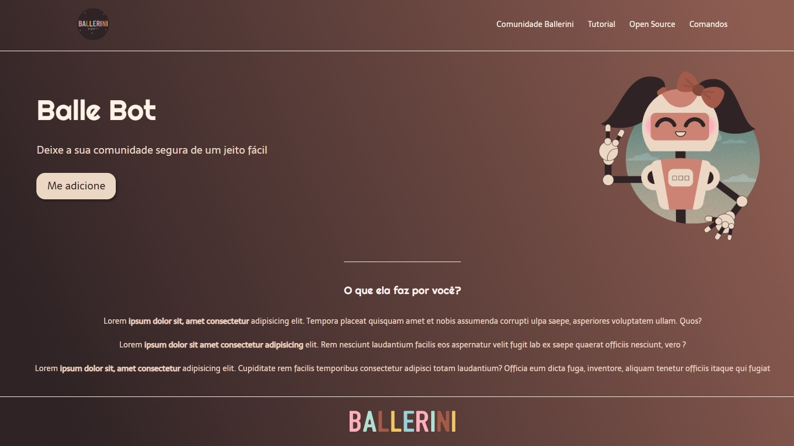

# landing-page-clonetutorial

Este é um projeto de clone de tutorial de uma landing page, desenvolvido apenas com HTML e CSS.

## :rocket: Acesse a Demonstração

Para visualizar a demonstração da landing page clonada, acesse o seguinte link: [Demo](https://dev-paixao.github.io/landing-page-clonetutorial/)

## :rocket: Prévia do Projeto

## :clipboard: Sobre o Projeto

O projeto consiste em um clone de tutorial de uma landing page, criada utilizando apenas HTML e CSS. A landing page clonada foi baseada em um tutorial do canal Rafaella Ballerini.

## :pushpin: Como Usar

1. Faça o clone deste repositório para o seu ambiente local.

2. Abra o arquivo `index.html` em seu navegador web.

3. Explore a landing page clonada e suas funcionalidades.

## :gear: Personalização

Esta landing page é um clone de tutorial, mas você pode personalizá-la de acordo com suas preferências, ajustando o design, as cores e os elementos visuais no arquivo CSS fornecido. Sinta-se à vontade para adaptar o projeto ao seu estilo ou necessidades específicas.

## :handshake: Contribuindo

Contribuições são bem-vindas! Se você deseja contribuir para este projeto, siga as etapas abaixo:

1. Faça um fork deste repositório.

2. Crie uma nova branch com uma descrição clara da sua alteração: `git checkout -b nome-da-sua-branch`.

3. Faça as alterações desejadas no código.

4. Realize commits com mensagens descritivas: `git commit -m "Descrição das alterações"`.

5. Envie as alterações para o seu repositório fork: `git push origin nome-da-sua-branch`.

6. Abra um pull request neste repositório, explicando as alterações que foram feitas.

7. Aguarde a revisão e o feedback.

## :page_facing_up: Licença

Este projeto está licenciado sob a licença [MIT](LICENSE).
